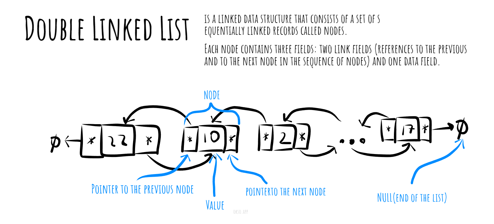

# Doubly Linked List

A double linked list, is a data structure used in computer programming to store and organize a collection of elements. It is an extension of the concept of a linked list, but with the additional feature of each node having a reference to both its previous node and its next node.

In a doubly linked list, each node contains two pointers or references: one pointing to the previous node and one pointing to the next node in the list. This allows for traversal in both directions, from the head (the first node) to the tail (the last node) and vice versa.

*Made with [okso.app](https://okso.app)*

## Complexities

### Time Complexity

| Access    | Search    | Insertion | Deletion  |
| :-------: | :-------: | :-------: | :-------: |
| O(n)      | O(n)      | O(1)      | O(n)      |

### Space Complexity

O(n)

## References

- [Wikipedia](https://en.wikipedia.org/wiki/Linked_list)
- [YouTube](https://www.youtube.com/watch?v=njTh_OwMljA&index=2&t=1s&list=PLLXdhg_r2hKA7DPDsunoDZ-Z769jWn4R8)