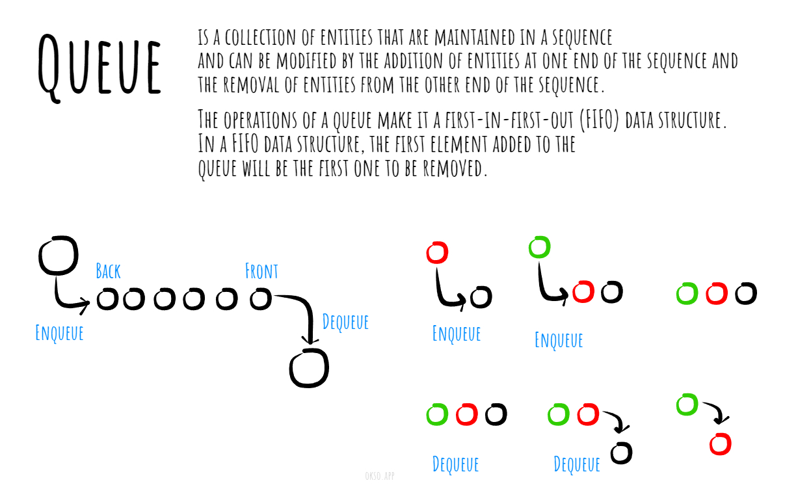

# Queue

A queue is a linear data structure that follows the First-In-First-Out (FIFO) principle. It is similar to a real-life queue where people stand in line and the person who arrives first is the first to be served.In a queue data structure, elements are inserted at one end called the "rear" and removed from the other end called the "front." This ordering ensures that the first element inserted is the first one to be removed.

The two primary operations performed on a queue are:
- Enqueue: It adds an element to the rear of the queue. The newly added element becomes the last in the queue.
- Dequeue: It removes the element from the front of the queue. The element that has been in the queue the longest is the first to be removed.

These operations maintain the order of elements in the queue, ensuring that the oldest element is always at the front, and the newest element is always at the rear.

Made with [okso.app](https://okso.app)_

## Complexities

### Time Complexity

| Access | Search | Insertion | Deletion |
| :----: | :----: | :-------: | :------: |
|  O(n)  |  O(n)  |   O(1)    |   O(1)   |

### Space Complexity

O(n)

## References

- [Wikipedia](https://en.wikipedia.org/wiki/Queue_(abstract_data_type))
- [YouTube](https://www.youtube.com/watch?v=wjI1WNcIntg&list=PLLXdhg_r2hKA7DPDsunoDZ-Z769jWn4R8&index=3&)