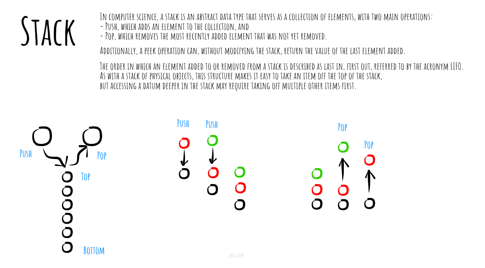

In computer science, a stack is a linear data structure that follows the Last In, First Out (LIFO) principle. It means that the last element added to the stack is the first one to be removed. Imagine a stack of plates; you can only add or remove plates from the top of the stack.

A stack has two primary operations:

- push: This operation is used to add an element to the top of the stack.
- pop: This operation is used to remove the element from the top of the stack.

Additionally, there is often a third operation:

- peek (or Top): This operation retrieves the element from the top of the stack without removing it.

These operations are analogous to pushing a new plate onto the stack, popping a plate from the top of the stack, and peeking at the top plate without removing it from the stack.

Made with [okso.app](https://okso.app)_

## Complexities

### Time Complexity

| Access | Search | Insertion | Deletion |
| :----: | :----: | :-------: | :------: |
|  O(n)  |  O(n)  |   O(1)    |   O(1)   |

### Space Complexity

O(n)

## References

- [Wikipedia](https://en.wikipedia.org/wiki/Stack_(abstract_data_type))
- [YouTube](https://www.youtube.com/watch?v=wjI1WNcIntg&list=PLLXdhg_r2hKA7DPDsunoDZ-Z769jWn4R8&index=3&)