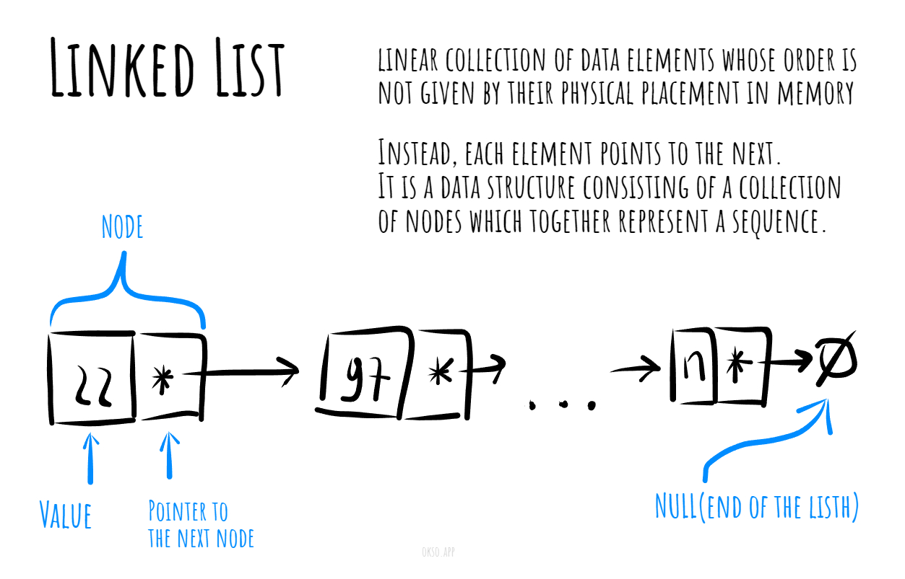

# Liked List

A linked list is a common data structure used in computer science to store and manage collections of data. It consists of a sequence of nodes, where each node contains a value and a reference or link to the next node in the sequence. The linked list does not necessarily occupy a contiguous block of memory like an array does.

The basic building block of a linked list is the node. Each node contains two main components: the data or value to be stored and a pointer or reference to the next node in the list. The last node in the list typically has a null reference to indicate the end of the list.

*Made with [okso.app](https://okso.app)*

## Complexities

### Time Complexity

| Access    | Search    | Insertion | Deletion  |
| :-------: | :-------: | :-------: | :-------: |
| O(n)      | O(n)      | O(1)      | O(n)      |

### Space Complexity

O(n)

## References

- [Wikipedia](https://en.wikipedia.org/wiki/Linked_list)
- [YouTube](https://www.youtube.com/watch?v=njTh_OwMljA&index=2&t=1s&list=PLLXdhg_r2hKA7DPDsunoDZ-Z769jWn4R8)